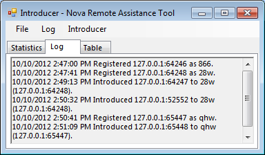
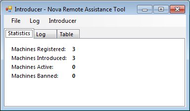
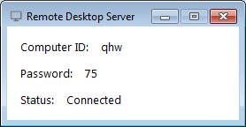
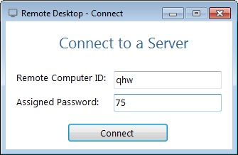

TeamViewer là một phần mềm điều khiển từ xa và chia sẻ màn hình phổ biến, được sử dụng rộng rãi trong các lĩnh vực hỗ trợ kỹ thuật, làm việc từ xa và cộng tác trực tuyến.
 Các tính năng chính mà remotedesktop kế thừa từ teawviewer

Điều khiển từ xa: remotedesktop  cho phép bạn truy cập và điều khiển máy tính từ xa qua Internet, giống như bạn đang ngồi trực tiếp trước máy tính đó.
Chia sẻ màn hình: Bạn có thể chia sẻ màn hình của mình với người khác để thuyết trình, hỗ trợ kỹ thuật hoặc cộng tác làm việc.
Chuyển file: Dễ dàng truyền tải file giữa các máy tính đang kết nối.

# remotedesktop
